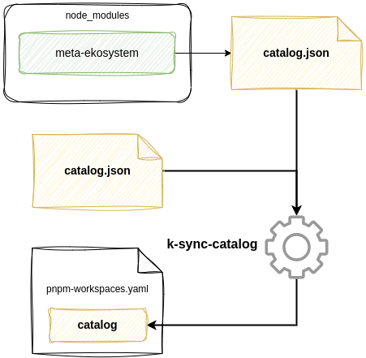

# meta-ekosystem

[](https://opensource.org/licenses/MIT)
[](https://github.com/kalisio/meta-ekosystem/releases)
[](https://www.npmjs.com/package/@kalisio/meta-ekosystem)

> Kalisio's meta-repo for sharing tools, configurations, and conventions

This package centralizes common development resources used across Kalisio projects, including:
- A meta package catalog for ecosystem managment
- Various scripts to be included in monorepo projects that includes this meta-repo
- Various code genertors to help creating monorepo projects
- Common conventions

> [!IMPORTANT]
> Before getting started, make sure you have the following prerequisites installed:
> - [Node.js](https://nodejs.org/) >= 20
> - [pnpm](https://pnpm.io/) >= 10

## Usage

This repository is designed to be included as a development dependency in your monorepo, providing access to the different shared resources.

### Installation

``` bash
pnpm add -D @kalisio/meta-ekosystem
```

### Catalog

The [`catalog.json`](./catalog.json) file, also referred to as the **meta-catalog**, centralizes and maintains the list of all dependencies, along with their respective versions, to ensure consistency and alignment across the **Kalisio** ecosystem.

> [!TIP]
> Use the [k-sync-catalog](#k-sync-catalog) commands to keep your local catalog synchronized with this meta-catalog.

### Commands

The commands are intended to be used by monorepo projects that depend on this repository.

#### k-init-docs

* Description

It generates a [VitePress](https://vitepress.dev/) skeleton in a `docs/` directory with the following structure:

```
docs
├── about
│   ├── contact.md
│   ├── contributing.md
│   ├── introduction.md
│   └── license.md
├── index.md
└── .vitepress
    ├── config.mjs
    └── theme
        ├── custom.css
        └── index.js
```

* Usage

```bash
pnpm k-init-docs
```

#### k-init-monorepo

* Description

It generates a **monorepo** skeleton with the following structure:

```
monorepo
├── CONTRIBUTING.md
├── .gitignore
├── .husky
│   └── pre-commit
├── LICENSE.md
├── package.json
├── pnpm-workspace.yaml
├── README.md
├── sonar-project.properties
├── vite.config.js
└── vitest.config.js
```

* Usage

```bash
pnpm k-init-monorepo
```

>[!NOTE]
> You will be prompted for the repository `name` and `path`.

#### k-init-pacakge

* Description

It generates a **package** skeleton with the following structure:

```
package
├── LICENSE.md
├── package.json
├── README.md
└── vite.config.js
```

* Usage

```bash
pnpm k-init-package
```

>[!NOTE]
> You will be prompted for the pacakge `name` and `description`.

#### k-gen-docs

It generates [VitePress](https://vitepress.dev/)-compatible Markdown documentation from JSDoc comments by scanning monorepo packages and rendering them using [Handlebars template](./templates/jsdoc2md/jsdoc2md.hbs) into a `docs/` directory.

* Usage

```bash
pnpm k-gen-docs
```

#### k-sync-catalog

* Description

It synchronizes your project catalog by merging the **meta-catalog** with an existing local catalog file and updating the catalog property in `pnpm-workspace.yaml`.

<div align="center">
  
</div>

* Usage

```bash
pnpm k-sync-catalog
```

## Contributing

### Guidelines

Found a bug ? Missing a Feature ? Want to contribute ? check out our [contribution guidelines](./docs/CONTRIBUTING.md) for details.

### Development

#### Setup

```bash
# Clone the repository
git clone https://github.com/kalisio/meta-ekosystem.git
cd meta-ekosystem

# Install dependencies
pnpm install
```

#### Linking locally

This repository provides global binaries to help manage the monorepo ecosystem. During development, you will often need to link this package to other projects to test the features you are working on.

If you're working on multiple packages simultaneously:

```bash
# In meta-ekosystem directory
pnpm link --global

# In your project directory
pnpm link --global @kalisio/meta-ekosystem
```

Or for a direct local link:

```bash
# In your project directory
pnpm link ../path/to/meta-ekosystem
```

To stop linking a local version and switch back to the published version:

```bash
# In your project directory
pnpm unlink @kalisio/meta-ekosystem
```

## License

Licensed under the [MIT license](LICENSE).

Copyright (c) 2026 [Kalisio](https://kalisio.com)

[](https://kalisio.com)
