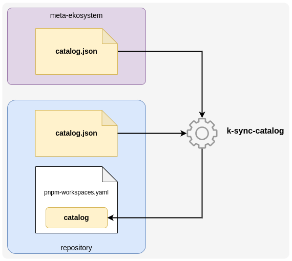

# meta-ekosystem

[](https://github.com/kalisio/meta-ekosystem/releases)
[](https://www.npmjs.com/package/@kalisio/meta-ekosystem)
[](https://opensource.org/licenses/MIT)


_Kalisio's meta-repo for sharing tools, configurations, and conventions_

---

This repository centralizes common development resources used across Kalisio projects, including:
- A meta package catalog for ecosystem management
- Various scripts to be included in monorepo projects that includes this meta-repo
- Various code generators to help creating monorepo projects
- Common conventions

> [!IMPORTANT]
> Before getting started, make sure you have the following prerequisites installed:
> - [Node.js](https://nodejs.org/) >= 20
> - [pnpm](https://pnpm.io/) >= 10

## Usage

This repository is designed to be included as a development dependency in your monorepo, providing access to the different shared resources.

### Installation

``` bash
pnpm add -D @kalisio/meta-ekosystem
```

### Catalog

The [`catalog.json`](./catalog.json) file, also referred to as the **meta-catalog**, centralizes and maintains the list of all dependencies, along with their respective versions, to ensure consistency and alignment across the **Kalisio** ecosystem.

> [!TIP]
> Use the [k-sync-catalog](#k-sync-catalog) commands to keep your local catalog synchronized with this meta-catalog.

### Commands

The commands are intended to be used by monorepo projects that depend on this repository.

>[!TIP]
> To run a command from this repository, use:
> `node ./bin/<command>`

#### k-init-docs

* Description

It generates a [VitePress](https://vitepress.dev/) skeleton in a `docs/` directory with the following structure:

```
docs
├── about
│   ├── contact.md
│   ├── contributing.md
│   ├── introduction.md
│   └── license.md
├── index.md
└── .vitepress
    ├── config.mjs
    └── theme
        ├── custom.css
        └── index.js
```

* Usage

```bash
pnpm k-init-docs
```

#### k-init-monorepo

* Description

It generates a **monorepo** skeleton with the following structure:

```
monorepo
├── .changeset
│   └── config.json
├── .editorconfig
├── .gitignore
├── .husky
│   └── pre-commit
├── LICENSE.md
├── package.json.hbs
├── pnpm-workspace.yaml
├── README.md.hbs
├── sonar-project.properties.hbs
├── vite.config.js
└── vitest.config.js
```

* Usage

```bash
pnpm k-init-monorepo
```

>[!NOTE]
> You will be prompted for the repository `name` and `path`.

#### k-init-package

* Description

It generates a **package** skeleton with the following structure:

```
package
├── LICENSE.md
├── package.json
├── README.md
└── vite.config.js
```

* Usage

```bash
pnpm k-init-package
```

>[!NOTE]
> You will be prompted for the package `name` and `description`.

#### k-init-example

* Description

It generates an **example** skeleton with the following structure:

```
package
├── LICENSE.md
├── package.json
├── README.md
└── vite.config.js
```

* Usage

```bash
pnpm k-init-example
```

>[!NOTE]
> You will be prompted for the example `name`.

>[!IMPORTANT]
> The `name` is used to declare the dependency on the package named `@kalisio/<name>`

#### k-sync-catalog

* Description

It synchronizes your project catalog by merging the **meta-catalog** with an existing local catalog file and updating
the catalog property in `pnpm-workspace.yaml`.

<div align="center">
  
</div>

* Usage

```bash
pnpm k-sync-catalog
```

## Contributing

### Guidelines

Found a bug ? Missing a feature ? Want to contribute ? Please refer to our [contribution guidelines](./docs/CONTRIBUTING.md)
for details.

### Development

#### Setup

```bash
# Clone the repository
git clone https://github.com/kalisio/meta-ekosystem.git
cd meta-ekosystem

# Install dependencies
pnpm install
```

#### Local linking

This repository provides global binaries to help manage the monorepo ecosystem. During development, you will often
need to link this package to other projects to test the features you are working on.

If you're working on multiple packages simultaneously:

```bash
# In the meta-ekosystem directory
pnpm link --global

# In your project directory
pnpm link --global @kalisio/meta-ekosystem
```

Or for a direct local link:

```bash
# In your project directory
pnpm link ../path/to/meta-ekosystem
```

To stop linking a local version and switch back to the published version:

```bash
# In your project directory
pnpm unlink @kalisio/meta-ekosystem
```

### Linting

```bash
# In the meta-ekosystem directory
pnpm lint
```

> [!NOTE]
> This repository follows the [standardJS](https://standardjs.com/) style guide for linting and code consistency.
> By default, **standard** is called with the `--fix` option to automatically fix style issues before committing.

### Versioning

Create changesets as needed during the development phase using:

```bash
pnpm changeset
```

> [!NOTE]
> It is recommended to create a changeset for each significant commit, e.g., a fix or feat.

Then update the **version** using:

```bash
pnpm changeset:version
```

And commit the changes:

```bash
git add . && git commit -m "chore: released <new version>"
```

### Publishing

To publish this package to [NPM](https://www.npmjs.com/), use:

```bash
pnpm changeset:publish
git push --follow-tags
```

> [!NOTE]
> When publishing a tag will be created corresponding to the **version** defined in the `package.json`

## License

Licensed under the [MIT License](LICENSE).

Copyright (c) 2026 [Kalisio](https://kalisio.com)

[](https://kalisio.com)
